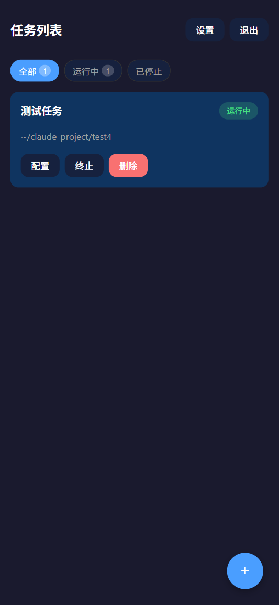
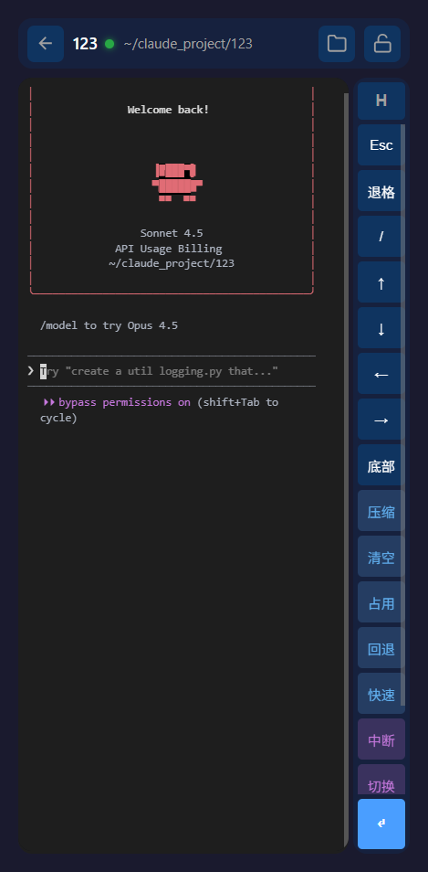
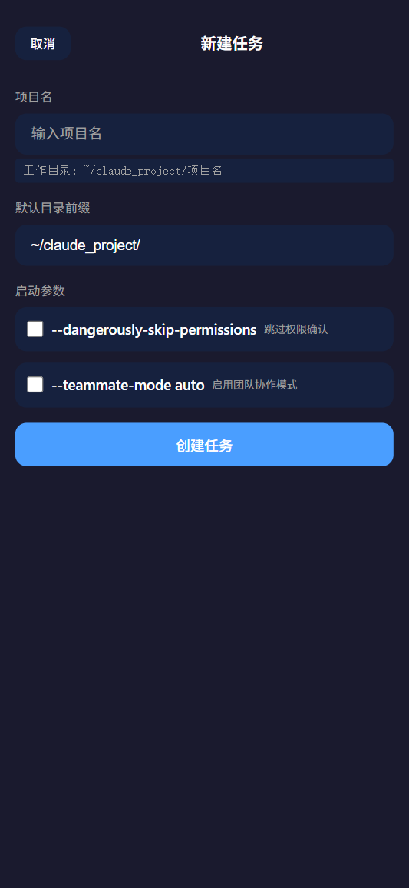
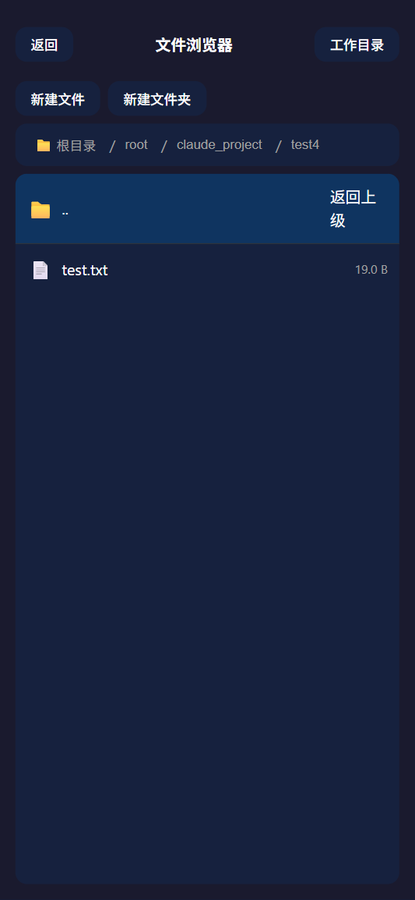
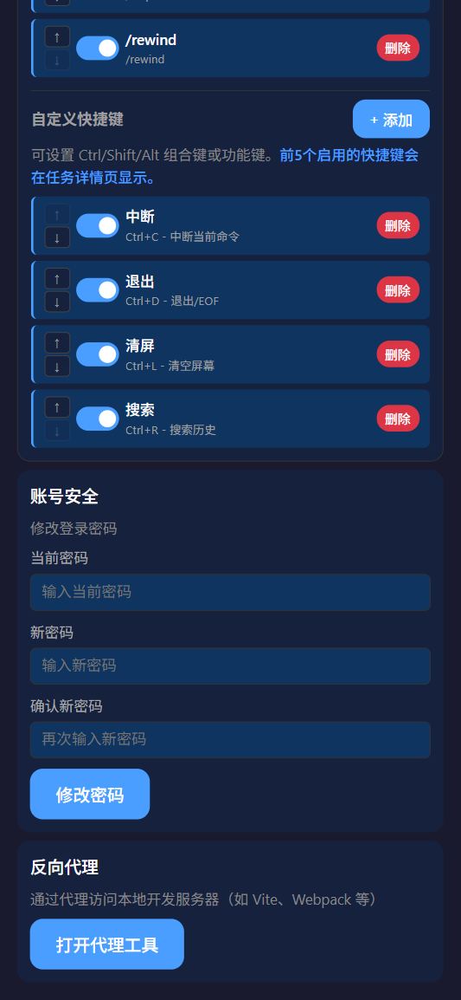

# Claude Remote

Claude Code 远程任务管理工具，通过浏览器远程管理和控制 Claude Code 终端会话。


## 界面预览

### 主界面


任务列表页面，显示所有 Claude Code 任务的运行状态。

### 对话界面


远程终端界面，实时显示 Claude Code 的输出，支持快捷键面板。

### 新建任务


创建新的 Claude Code 任务，支持配置工作目录和运行参数。

### 文件管理


浏览任务的工作目录，查看和编辑文件。

### 设置界面


自定义命令按钮和快捷键，支持云端同步。

## 功能特性

- **远程终端** - 基于 xterm.js 的完整终端模拟，支持实时 WebSocket 通信
- **任务管理** - 创建、恢复、监控 Claude Code 任务
- **快捷键系统** - 自定义命令和快捷键，云端同步
- **文件管理** - 浏览工作目录，查看文件内容
- **反向代理** - 访问本地其他开发服务器
- **移动端适配** - 响应式布局，触摸优化

## 快速开始

### 环境要求

- Linux 服务器（Ubuntu 22.04+）或 WSL2
- Node.js 18+
- Python 3.10+
- tmux

### 安装

```bash
# 克隆项目
git clone https://github.com/shaoyi1998/claude_remote.git
cd claude_remote

# 安装后端依赖
cd backend
pip install -r requirements.txt
cp .env.example .env

# 安装前端依赖
cd ../frontend
npm install
```

### 启动

```bash
# 启动后端（在wsl的 backend 目录）
python3 -m uvicorn main:app --host 0.0.0.0 --port 8000

# 在windows cmd下启动（用wsl启动 D:\pycharm项目\claude_code远程\backend 的项目）
 wsl -d Ubuntu-22.04 -- bash -c "cd '/mnt/d/pycharm项目/claude_code远程/backend' && python3 -m uvicorn main:app --host 0.0.0.0 --port 8000" 

# 启动前端（在 frontend 目录）
npm run dev
```

### 访问与初始化

1. 打开浏览器访问 http://localhost:3000
2. 首次使用会跳转到登录页面
3. 点击 **「初始化管理员」** 按钮创建管理员账号
4. 使用以下凭据登录：
   - **用户名**: `admin`
   - **密码**: `admin123`
5. **登录后请立即修改密码！**（设置 → 修改密码）

> ⚠️ 安全提醒：默认密码仅用于首次初始化，生产环境务必修改！

## 外网访问方案

### 方案一：直接部署在公网 Linux 服务器（最简单）

如果你有公网 Linux 服务器，直接在上面部署 Claude Remote，无需 WireGuard。

> **优势**：最简单，只需 Nginx 反向代理。

#### 架构图

```
                    互联网
                       |
              公网服务器 (VPS)
              IP: 1.2.3.4
              Nginx + Claude Remote
```

#### 1. 在服务器上部署

```bash
# 克隆项目
git clone https://github.com/shaoyi1998/claude_remote.git
cd claude_remote

# 安装后端依赖
cd backend
pip install -r requirements.txt
cp .env.example .env
# 编辑 .env 修改 SECRET_KEY

# 安装前端依赖并构建
cd ../frontend
npm install
npm run build
```

#### 2. 启动服务

```bash
# 后台启动后端
cd backend
nohup python3 -m uvicorn main:app --host 127.0.0.1 --port 8000 > backend.log 2>&1 &

# 使用 serve 或 nginx 托管前端静态文件
# 方式一：使用 serve
npm install -g serve
nohup serve -s ../frontend/dist -l 3000 > frontend.log 2>&1 &

# 方式二：直接用 Nginx 托管（推荐）
```

#### 3. 配置 Nginx

```nginx
# /etc/nginx/sites-available/claude-remote
server {
    listen 8080;  # 或其他端口
    server_name _;

    # 前端静态文件
    location / {
        root /path/to/claude_remote/frontend/dist;
        try_files $uri $uri/ /index.html;
    }

    # 后端 API
    location /api/ {
        proxy_pass http://127.0.0.1:8000/api/;
        proxy_http_version 1.1;
        proxy_set_header Host $host;
        proxy_set_header X-Real-IP $remote_addr;
    }

    # WebSocket（终端）
    location /ws/ {
        proxy_pass http://127.0.0.1:8000/ws/;
        proxy_http_version 1.1;
        proxy_set_header Upgrade $http_upgrade;
        proxy_set_header Connection "upgrade";
        proxy_set_header Host $host;
        proxy_read_timeout 86400;
    }

    # 反向代理（可选）
    location /proxy/ {
        proxy_pass http://127.0.0.1:8000/proxy/;
        proxy_http_version 1.1;
        proxy_set_header Upgrade $http_upgrade;
        proxy_set_header Connection "upgrade";
    }
}
```

```bash
# 启用配置
sudo ln -s /etc/nginx/sites-available/claude-remote /etc/nginx/sites-enabled/
sudo nginx -t
sudo systemctl reload nginx
```

访问地址：`http://1.2.3.4:8080`

---

### 方案二：公网服务器 + WireGuard + Nginx 转发（穿透内网）

如果你有一台公网服务器，可以通过 WireGuard VPN 连接家用电脑，然后用 Nginx 反向代理实现外网访问。

> **适用场景**：Claude Remote 运行在家用电脑（内网），通过公网服务器暴露服务。

#### 架构图

```
                    互联网
                       |
              公网服务器 (VPS)
              IP: 1.2.3.4
              Nginx + WireGuard
                       |
                  WireGuard VPN
                       |
              家用电脑 (内网)
              IP: 10.0.0.2 (VPN)
              Claude Remote
```

#### 1. 安装 WireGuard

**公网服务器（VPS）**：
```bash
# Ubuntu/Debian
sudo apt update
sudo apt install wireguard

# 生成密钥
wg genkey | tee privatekey | wg pubkey > publickey
```

**家用电脑**：
```bash
sudo apt install wireguard
wg genkey | tee privatekey | wg pubkey > publickey
```

#### 2. 配置 WireGuard

**公网服务器 `/etc/wireguard/wg0.conf`**：
```ini
[Interface]
Address = 10.0.0.1/24
ListenPort = 51820
PrivateKey = <VPS的私钥>

[Peer]
PublicKey = <家用电脑的公钥>
AllowedIPs = 10.0.0.2/32
```

**家用电脑 `/etc/wireguard/wg0.conf`**：
```ini
[Interface]
Address = 10.0.0.2/24
PrivateKey = <家用电脑的私钥>

[Peer]
PublicKey = <VPS的公钥>
Endpoint = 1.2.3.4:51820
AllowedIPs = 10.0.0.0/24
PersistentKeepalive = 25
```

#### 3. 启动 WireGuard

```bash
# 两台机器都执行
sudo wg-quick up wg0

# 设置开机自启
sudo systemctl enable wg-quick@wg0
```

#### 4. 配置 Nginx（公网服务器）

**方式一：无需域名，直接用 IP + 端口（简单快速）**

```nginx
# /etc/nginx/sites-available/claude-remote
server {
    listen 8080;  # 使用非标准端口，避免与其他服务冲突
    server_name _;

    # 前端
    location / {
        proxy_pass http://10.0.0.2:3000;
        proxy_http_version 1.1;
        proxy_set_header Upgrade $http_upgrade;
        proxy_set_header Connection 'upgrade';
        proxy_set_header Host $host;
        proxy_set_header X-Real-IP $remote_addr;
        proxy_cache_bypass $http_upgrade;
    }

    # 后端 API
    location /api/ {
        proxy_pass http://10.0.0.2:8000/api/;
        proxy_http_version 1.1;
        proxy_set_header Host $host;
        proxy_set_header X-Real-IP $remote_addr;
    }

    # WebSocket（终端）
    location /ws/ {
        proxy_pass http://10.0.0.2:8000/ws/;
        proxy_http_version 1.1;
        proxy_set_header Upgrade $http_upgrade;
        proxy_set_header Connection "upgrade";
        proxy_set_header Host $host;
        proxy_read_timeout 86400;
    }

    # 反向代理（可选）
    location /proxy/ {
        proxy_pass http://10.0.0.2:8000/proxy/;
        proxy_http_version 1.1;
        proxy_set_header Upgrade $http_upgrade;
        proxy_set_header Connection "upgrade";
    }
}
```

访问地址：`http://1.2.3.4:8080`

**方式二：使用域名 + HTTPS（更安全）**

```nginx
# /etc/nginx/sites-available/claude-remote
server {
    listen 80;
    server_name your-domain.com;  # 或使用 IP

    # 强制 HTTPS
    return 301 https://$server_name$request_uri;
}

server {
    listen 443 ssl http2;
    server_name your-domain.com;

    # SSL 证书（使用 Let's Encrypt）
    ssl_certificate /etc/letsencrypt/live/your-domain.com/fullchain.pem;
    ssl_certificate_key /etc/letsencrypt/live/your-domain.com/privkey.pem;

    # SSL 配置
    ssl_protocols TLSv1.2 TLSv1.3;
    ssl_ciphers ECDHE-ECDSA-AES128-GCM-SHA256:ECDHE-RSA-AES128-GCM-SHA256;
    ssl_prefer_server_ciphers off;

    # 前端
    location / {
        proxy_pass http://10.0.0.2:3000;
        proxy_http_version 1.1;
        proxy_set_header Upgrade $http_upgrade;
        proxy_set_header Connection 'upgrade';
        proxy_set_header Host $host;
        proxy_set_header X-Real-IP $remote_addr;
        proxy_set_header X-Forwarded-For $proxy_add_x_forwarded_for;
        proxy_set_header X-Forwarded-Proto $scheme;
        proxy_cache_bypass $http_upgrade;
    }

    # 后端 API
    location /api/ {
        proxy_pass http://10.0.0.2:8000/api/;
        proxy_http_version 1.1;
        proxy_set_header Host $host;
        proxy_set_header X-Real-IP $remote_addr;
        proxy_set_header X-Forwarded-For $proxy_add_x_forwarded_for;
        proxy_set_header X-Forwarded-Proto $scheme;
    }

    # WebSocket（终端）
    location /ws/ {
        proxy_pass http://10.0.0.2:8000/ws/;
        proxy_http_version 1.1;
        proxy_set_header Upgrade $http_upgrade;
        proxy_set_header Connection "upgrade";
        proxy_set_header Host $host;
        proxy_set_header X-Real-IP $remote_addr;
        proxy_read_timeout 86400;
    }

    # 反向代理（可选）
    location /proxy/ {
        proxy_pass http://10.0.0.2:8000/proxy/;
        proxy_http_version 1.1;
        proxy_set_header Host $host;
        proxy_set_header X-Real-IP $remote_addr;

        # 如果需要 WebSocket 代理
        proxy_set_header Upgrade $http_upgrade;
        proxy_set_header Connection "upgrade";
    }
}
```

#### 5. 申请 SSL 证书

```bash
# 安装 Certbot
sudo apt install certbot python3-certbot-nginx

# 申请证书
sudo certbot --nginx -d your-domain.com
```

#### 6. 修改后端 CORS 配置

编辑家用电脑上的 `backend/.env`：
```ini
CORS_ORIGINS=https://your-domain.com
```

### 方案三：Cloudflare Tunnel（最简单，需域名）

如果你不想配置 WireGuard，可以使用 Cloudflare Tunnel：

```bash
# 安装 cloudflared
curl -L https://github.com/cloudflare/cloudflared/releases/latest/download/cloudflared-linux-amd64 -o cloudflared
chmod +x cloudflared

# 登录
./cloudflared tunnel login

# 创建隧道
./cloudflared tunnel create claude-remote

# 运行隧道
./cloudflared tunnel run --url http://localhost:3000 claude-remote
```

然后在 Cloudflare Dashboard 配置 DNS 指向隧道。

## 生产环境部署

### 环境变量

```ini
# backend/.env
SECRET_KEY=请使用32位以上随机字符串
CORS_ORIGINS=https://your-domain.com
ACCESS_TOKEN_EXPIRE_MINUTES=10080
```

### 使用 Gunicorn

```bash
pip install gunicorn
gunicorn main:app -w 4 -k uvicorn.workers.UvicornWorker -b 0.0.0.0:8000
```

### 前端构建

```bash
cd frontend
npm run build
# 产物在 dist/ 目录
```

## 技术栈

| 前端 | 后端 |
|------|------|
| Vue 3 | FastAPI |
| Vue Router | SQLAlchemy |
| xterm.js | python-jose (JWT) |
| CSS Variables | tmux (libtmux) |

## 项目结构

```
claude_remote/
├── frontend/          # Vue 3 前端
├── backend/           # FastAPI 后端
│   ├── api/          # API 路由
│   ├── services/     # 业务逻辑
│   ├── models/       # 数据模型
│   └── config.py     # 配置
├── CLAUDE.md         # 开发文档
├── 启动.md           # 启动指南
└── README.md         # 本文档
```

## 安全提醒

1. **修改默认密码** - 首次登录后立即修改（默认: admin / admin123）
2. **设置强密钥** - 生产环境 SECRET_KEY 使用随机字符串
3. **配置 CORS** - 限制允许的来源域名
4. **使用 HTTPS** - 生产环境必须使用 SSL
5. **定期备份** - 备份 `claude_remote.db` 数据库文件

## License

MIT License

## 相关链接

- [Claude Code](https://claude.ai/code) - Anthropic 的 AI 编程助手
- [启动指南](./启动.md) - 详细的安装和配置说明
- [开发文档](./CLAUDE.md) - 架构和开发指南
